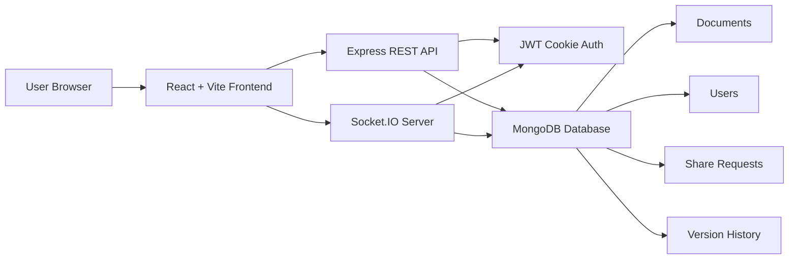

# Collabify


> A modern real-time collaborative document editor with rich formatting, live teamwork, sharing, invitations, and version history.

Collabify is a Google Docs-style collaborative editor built with React, Vite, Tailwind CSS, Node.js, Express, MongoDB, and Socket.IO. It lets users create documents, invite collaborators, edit together in real time, track active users, save automatically, restore previous versions, and enrich documents with media, links, shapes, and movable text boxes.

---

## ✨ Key Features

### 🔐 Authentication

- User registration, login, and logout
- Google sign-in
- JWT cookie-based sessions
- Password hashing with bcrypt
- Protected frontend routes
- Authenticated REST APIs and Socket.IO connections

### 📄 Document Workspace

- Dashboard for accessible documents
- Create, open, rename, and delete documents
- Owner-only delete visibility
- Shared document badges
- MongoDB persistence with Mongoose models
- Clean responsive document cards

### 🤝 Sharing And Invitations

- Share modal inside the editor
- Add collaborators by email
- Remove collaborators
- Copy invite link
- Pending invitation workflow
- Accept or reject invitations
- Shared documents appear after accepting invitations

### ⚡ Real-Time Collaboration

- Socket.IO document rooms
- Live Quill delta synchronization
- Active users list
- Typing indicators
- Socket authorization before joining documents
- Document not found and unauthorized access handling

### 💾 Saving And History

- Autosave while editing
- Manual save button
- Save status indicator
- Version history modal
- Restore previous versions
- Duplicate version snapshot filtering

### 📝 Rich Editor Experience

- `react-quill-new` editor integration
- Google Docs-style custom toolbar
- Font family and font size controls
- Paragraph styles
- Bold, italic, underline, strike
- Text color and highlight color
- Alignment and list controls
- Link insertion modal
- Local image upload
- Local video upload
- SVG shapes insertion
- Movable editable text boxes
- Clear formatting

---

## 🧰 Tech Stack

| Layer | Technologies |
| --- | --- |
| Frontend | React 19, Vite, Tailwind CSS |
| Editor | react-quill-new, Quill formats/blots |
| UI Icons | lucide-react |
| HTTP Client | Axios |
| Realtime Client | Socket.IO client |
| Backend | Node.js, Express |
| Database | MongoDB, Mongoose |
| Realtime Server | Socket.IO |
| Authentication | JWT cookies, bcrypt, Google OAuth |
| Email/Invites | Nodemailer |

---

## 🖼️ Screenshots

> Add real screenshots to these placeholders before publishing or submitting the project.

| Page | Preview |
| --- | --- |
| Login page | `screenshots/login-page.png` |
| Dashboard | `screenshots/dashboard.png` |
| Editor | `screenshots/editor.png` |
| Share modal | `screenshots/share-modal.png` |


```text
screenshots/
├── login-page.png
├── dashboard.png
├── editor.png
└── share-modal.png
```

---

## 🏗️ System Architecture



### Request Flow

1. The user authenticates through email/password or Google sign-in.
2. The backend stores the session in a JWT cookie.
3. Protected frontend routes request user and document data through Axios.
4. The editor joins a Socket.IO document room after authorization.
5. Quill deltas are broadcast to collaborators in the same room.
6. Document content is persisted in MongoDB through autosave and manual save.
7. Version history snapshots are stored and can be restored.

---

## 📁 Folder Structure

```text
Colloborative_Document_Editor/
├── backend/
│   ├── config/
│   │   └── db.js
│   ├── controllers/
│   │   ├── authController.js
│   │   ├── DocumentController.js
│   │   ├── shareController.js
│   │   └── versionController.js
│   ├── middlewares/
│   │   └── authMiddleware.js
│   ├── models/
│   │   ├── DocumentModel.js
│   │   ├── ShareRequestModel.js
│   │   ├── UserModel.js
│   │   └── VersionModel.js
│   ├── routes/
│   │   ├── authRoutes.js
│   │   ├── documentRoutes.js
│   │   ├── shareRoutes.js
│   │   └── versionRoutes.js
│   ├── sockets/
│   │   └── documentSocket.js
│   ├── utils/
│   │   ├── emailService.js
│   │   └── versionHistory.js
│   ├── app.js
│   └── server.js
├── frontend/
│   ├── public/
│   ├── src/
│   │   ├── api/
│   │   ├── components/
│   │   ├── context/
│   │   ├── editor/
│   │   ├── hooks/
│   │   ├── layouts/
│   │   ├── pages/
│   │   ├── routes/
│   │   ├── socket/
│   │   ├── utils/
│   │   ├── App.jsx
│   │   ├── index.css
│   │   └── main.jsx
│   ├── index.html
│   ├── tailwind.config.cjs
│   └── vite.config.js
├── reports/
├── package.json
└── README.md
```

---

## 🔑 Environment Variables

Create environment files in the backend and frontend folders. Do not commit real secrets.

### Backend `.env`

```env
DB_URL=your_mongodb_connection_string
PORT=4000
JWT_SECRET=your_jwt_secret
FRONTEND_URL=http://localhost:5173
FRONTEND_URLS=http://localhost:5173
GOOGLE_CLIENT_ID=your_google_client_id
EMAIL_USER=your_email_address
EMAIL_PASS=your_email_app_password
```

### Frontend `.env`

```env
VITE_BACKEND_URL=http://localhost:4000
VITE_GOOGLE_CLIENT_ID=your_google_client_id
```

---

## 🚀 Installation And Setup

### 1. Clone The Repository

```bash
git clone https://github.com/hareesh100807/Collaborative-Document-Editor.git
cd Collaborative-Document-Editor
```

### 2. Install Backend Dependencies

```bash
cd backend
npm install
```

### 3. Install Frontend Dependencies

```bash
cd ../frontend
npm install
```

### 4. Configure Environment Files

Create:

- `backend/.env`
- `frontend/.env`

Use the environment variable templates shown above.

### 5. Run The Backend

```bash
cd backend
npm run dev
```

The backend runs on:

```text
http://localhost:4000
```

### 6. Run The Frontend

```bash
cd frontend
npm run dev
```

The frontend runs on:

```text
http://localhost:5173
```

---

## 🔌 API Overview

### Auth Routes

| Method | Endpoint | Description |
| --- | --- | --- |
| `POST` | `/auth/register` | Register a new user |
| `POST` | `/auth/login` | Log in and set JWT cookie |
| `POST` | `/auth/logout` | Log out and clear session |
| `GET` | `/auth/me` | Get authenticated user |
| `POST` | `/auth/google` | Authenticate with Google |

### Document Routes

| Method | Endpoint | Description |
| --- | --- | --- |
| `POST` | `/documents` | Create a document |
| `GET` | `/documents` | Get owned and shared documents |
| `GET` | `/documents/:id` | Get one document |
| `PUT` | `/documents/:id` | Update document content |
| `DELETE` | `/documents/:id` | Delete owner document |
| `PATCH` | `/documents/:id/rename` | Rename document |
| `GET` | `/documents/:id/collaborators` | Get collaborators |

### Share Routes

| Method | Endpoint | Description |
| --- | --- | --- |
| `POST` | `/share/:documentId/collaborators` | Add collaborator by email |
| `POST` | `/share/:documentId/collaborators/remove` | Remove collaborator |
| `GET` | `/share/requests` | Get pending invitations |
| `POST` | `/share/requests/:requestId/accept` | Accept invitation |
| `POST` | `/share/requests/:requestId/reject` | Reject invitation |
| `POST` | `/share/:documentId/link` | Generate invite link |
| `GET` | `/share/invite/:token` | Accept/open invite link |

### Version Routes

| Method | Endpoint | Description |
| --- | --- | --- |
| `GET` | `/versions/:documentId` | Get version history |
| `POST` | `/versions/restore/:versionId` | Restore a version |

---

## 📡 Socket Events Overview

### Client To Server

| Event | Payload | Purpose |
| --- | --- | --- |
| `join-document` | `documentId` | Join a document room after authorization |
| `send-changes` | `delta, documentId` | Send local Quill changes to collaborators |
| `save-document` | `{ documentId, content }` | Persist current document content |
| `typing` | `{ documentId, username }` | Notify collaborators that a user is typing |
| `stop-typing` | `{ documentId, username }` | Clear typing indicator |

### Server To Client

| Event | Payload | Purpose |
| --- | --- | --- |
| `load-document` | `document` | Load document content into editor |
| `receive-changes` | `delta` | Apply collaborator changes silently |
| `active-users` | `users[]` | Show users currently online in the document |
| `user-typing` | `{ username }` | Show typing indicator |
| `user-stop-typing` | `{ username }` | Hide typing indicator |
| `document-not-found` | none | Handle missing document |
| `not-authorized` | none | Handle unauthorized access |
| `document-error` | `message` | Handle general socket document errors |

---

## 📝 Editor Features

Collabify includes a custom Google Docs-style editor experience powered by `react-quill-new`.

| Category | Features |
| --- | --- |
| Formatting | Paragraph styles, font family, font size, bold, italic, underline, strike |
| Colors | Text color and highlight/background color |
| Layout | Align left, center, right, justify, ordered lists, bullet lists |
| Insert | Links, local images, local videos, SVG shapes, movable text boxes |
| Collaboration | Live updates, active users, typing indicators |
| Persistence | Autosave, manual save, version history, restore |
| UX | Sticky toolbar, share modal, inline errors, responsive layout |

---

## 🤝 Collaboration Workflow

1. A document owner creates a document from the dashboard.
2. The owner opens the editor and clicks **Share**.
3. The owner can add a collaborator by email or copy an invite link.
4. The invited user sees the pending request in the notification menu.
5. The invited user accepts or rejects the invitation.
6. Accepted collaborators can open the shared document from the dashboard.
7. When collaborators edit together, changes sync live through Socket.IO.
8. Autosave stores document content and version history in MongoDB.
9. Any authorized collaborator can view and restore saved versions.

---

## 🧭 Future Improvements

- Role-based permissions such as viewer, commenter, and editor
- Comment threads and suggestions mode
- Document search and filtering
- Export to PDF or DOCX
- Cloud media storage for large image and video files
- Presence cursors with collaborator colors
- Notification emails for invitations
- Better version comparison view
- Offline editing and sync recovery
- End-to-end tests and deployment pipeline

---

## 👤 Author

**Hareesh**

- GitHub: [@hareesh100807](https://github.com/hareesh100807)
- Project: Collabify Collaborative Document Editor

---

## 📄 License

This project is intended for learning, demonstration, and academic presentation purposes. If you publish or distribute it publicly, add a `LICENSE` file with your preferred license terms.

---

<p align="center">
  Built with React, Node.js, MongoDB, Socket.IO, and a lot of document-editing ambition.
</p>
